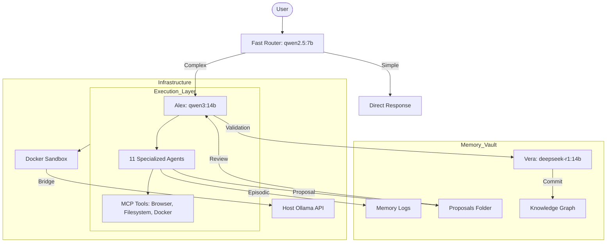

# Antigravity v3: Sovereign Multi-Agent Architecture

The Antigravity system is a Dockerized, MCP-based AI ecosystem optimized for local inference on Ollama. It utilizes a specialized 11-agent squad with strict memory governance and a whitelisted tool firewall.

## 1. System Architecture

## 2. The Agent Squad (11 Units)
| Agent | Role | Primary Model | Fallback Model |
| :--- | :--- | :--- | :--- |
| **Fast Router**| Triage | `qwen2.5:7b` | `qwen3:8b` |
| **Alex** | CEO | `qwen3:14b` | `qwen2.5:14b` |
| **Deep Thinker**| Architect | `deepseek-r1:14b` | `qwen3:14b` |
| **Caleb** | Coder | `qwen2.5-coder:14b`| `qwen2.5-coder:7b` |
| **Dax** | DevOps | `qwen2.5-coder:14b`| `qwen2.5-coder:7b` |
| **Rowan** | Researcher | `qwen3:14b` | `qwen2.5:14b` |
| **Atlas** | Analyst | `deepseek-r1:14b` | `qwen3:14b` |
| **Vera** | Verifier | `deepseek-r1:14b` | `qwen3:14b` |
| **Aria** | UX/Vision | `qwen2.5vl:latest` | `llama3.2-vision:latest` |
| **Nova** | Marketing | `qwen3:14b` | `qwen2.5:14b` |
| **Finn** | Strategist | `qwen3:14b` | `qwen2.5:14b` |

## 3. Memory Governance Schema
All memory entries must follow the **V3.4 Schema**:
- **Frontmatter**: 15 fields including `confidence_level`, `status` (proposed/approved), and `task_id`.
- **Episodic**: Saved as `.md` in `tru/Memory_Logs`.
- **Long-Term**: Initiated via `propose_ltm()` -> Validated by Vera -> Committed to `Knowledge_Graph`.
- **Distillation**: All raw Chain-of-Thought (`<thought>` tags) is stripped before saving.

## 4. Operational Guides
### **How to Add a New Agent**
1.  Add the agent definition to `agent_registry.yaml`.
2.  Create `agents/new_agent.py` inheriting from `BaseAgent`.
3.  Register the agent in `agents/__init__.py`.
4.  Create `Modelfile.new-agent` and run `ollama create`.

### **How to Add a New Model**
1.  Run `ollama pull <model_name>`.
2.  Update `agent_registry.yaml` with the new model as `primary` or `fallback`.

## 5. Troubleshooting
- **ImportError**: Ensure the agent is exported in `agents/__init__.py`.
- **Connection Error**: Check `OLLAMA_HOST` in `.env`. Must be `http://host.docker.internal:11434` for container access.
- **VRAM Lag**: Close background 14B models. The system will auto-fallback to 7B if the primary fails.

## 6. Validation Checklist
- [ ] `selfcheck.py` returns PASS on Docker mounts.
- [ ] `agent_registry.yaml` is the source of truth for all 11 agents.
- [ ] `Knowledge_Graph` is read-only for all agents except Vera.
